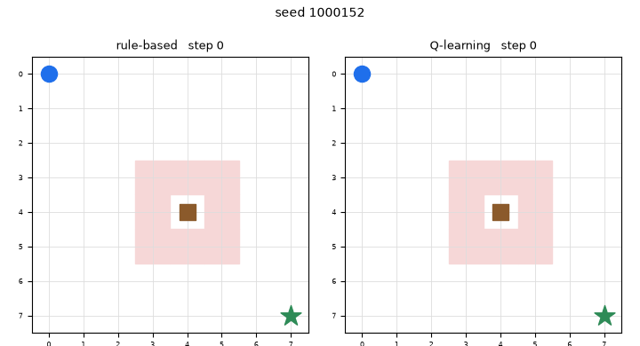

# CowWorld

An 8x8 grid where a robot has to reach a goal while a cow wanders across its
path. A tabular Q-learning agent is trained on it and compared against a
hand-written rule on the same episodes.

Built for ARIES Lab technical task 3.

## Setup

Python 3.9 or newer, CPU only.

```bash
python -m venv .venv
source .venv/bin/activate          # Windows: .venv\Scripts\activate
pip install gymnasium numpy matplotlib imageio
```

## Running it

```bash
# the two policies that need no training
python src/evaluate.py

# train, about 8 seconds, writes to results/
python src/train.py --episodes 30000 --clip 2 --tag base

# the wider observation radius
python src/train.py --episodes 30000 --clip 3 --tag clip3
python src/train.py --episodes 60000 --clip 3 --tag clip3_long

# reward ablation, and the harder world where the cow chases
python src/train.py --episodes 30000 --clip 2 --tag no_step --reward step=0
python src/train.py --episodes 30000 --clip 2 --cow-bias 0.7 --tag chase2
python src/train.py --episodes 30000 --clip 3 --cow-bias 0.7 --tag chase3

# side-by-side episodes of both policies on the same seeds
python src/make_gif.py --seeds 1000152 1000355 1000300 --out results/episodes.gif

# the checks
python tests/test_encode.py
python tests/test_step.py

# optional: drive the policy from a photograph instead of the grid.
# needs one extra dependency, and downloads the detector weights on first run.
pip install ultralytics opencv-python
python src/perception_bridge.py assets/cow.jpg --out assets/cow_annotated.jpg
```

Q-tables and training logs land in `results/` and are not committed, since the
task asks not to include model weights. Training regenerates them in seconds.

## Results

500 held-out episodes, seeds 1,000,000 onward. Training uses seeds from 0, so
nothing here was seen during training. Every policy is scored on the same seed
list, which matters because the cow moves on its own.

| policy | success | collision | timeout | steps to goal | return |
|---|---|---|---|---|---|
| random | 1.8% | 38.6% | 59.6% | 52.1 | -15.04 |
| rule-based | 97.0% | 2.2% | 0.8% | **16.2** | +15.17 |
| Q-learning, radius 2 | **99.0%** | **0.0%** | 1.0% | 17.4 | +16.86 |
| Q-learning, radius 3 | 85.0% | 0.0% | 15.0% | 27.3 | +13.61 |
| Q-learning, radius 3, 60k episodes | 96.8% | 0.0% | 3.2% | 18.2 | **+17.11** |

The shortest possible path is 14 steps, so the hand-written rule is already
close to optimal and there is not much room above it. What the learned policy
wins is the collision rate: zero across 500 episodes, for about one extra step
each.

| policy | steps inside the -3 ring | mean closest approach |
|---|---|---|
| rule-based | 4.74% | 2.33 |
| Q-learning, radius 2 | 2.22% | 2.07 |

The learned policy spends less than half as long beside the cow while passing
nearer to it, so it is crossing quickly rather than keeping a wider berth.


Both panels below run the same seed, so the cow does the same thing in each and
any difference is the robot.



### The harder world

With the cow chasing the robot on 70% of its moves, the hand-written rule drops
to 78.4% and collides on 21.6% of episodes, which finally leaves the learned
policy somewhere to win.

| policy | success | collision | steps | steps in ring |
|---|---|---|---|---|
| rule-based | 78.4% | 21.6% | 15.7 | 24.04% |
| Q, radius 2 | 92.0% | 7.6% | 25.6 | 12.36% |
| **Q, radius 3** | **95.0%** | **5.0%** | 19.2 | 8.98% |
| Q, trained in the easy world | 83.2% | 15.8% | 22.2 | 30.16% |

Radius 3 wins here and loses in the original world. Clipping the state was
justified by the cow being uniformly random, so a distant cow's position
predicted nothing. A cow with a direction breaks that, and the wider radius
starts paying. Section 7 of `docs/formulation.md` goes through it.

## Layout

```
src/cow_world.py     the environment: grid, rewards, cow movement, reset/step/render
src/encoding.py      observation -> Q-table index, at a chosen radius
src/policies.py      random, rule-based, and greedy-from-a-table
src/evaluate.py      shared-seed harness and the results table
src/train.py         tabular Q-learning
src/perception_bridge.py  optional: a cow photo -> agent state -> action
src/make_gif.py      side-by-side episodes of two policies on the same seeds
tests/               14 checks, mostly on the rules the task leaves open
docs/formulation.md  the design decisions, the alternatives dropped, and the results
```

## Notes

`docs/formulation.md` is the long version: why the state looks the way it does,
which episode rules the task does not specify and what I chose, and what the
numbers above mean. It was written as the work went rather than afterwards, so
it also records a claim I made and then disproved.

State is the robot's position plus the cow's offset clipped to a radius, which
is 1,600 rows at radius 2. The clipping lives in `encoding.py` rather than in
the environment: the world has exact positions, and treating two distant cows as
the same situation is the learner's choice. That also lets both radii run
against one environment on identical seeds.
