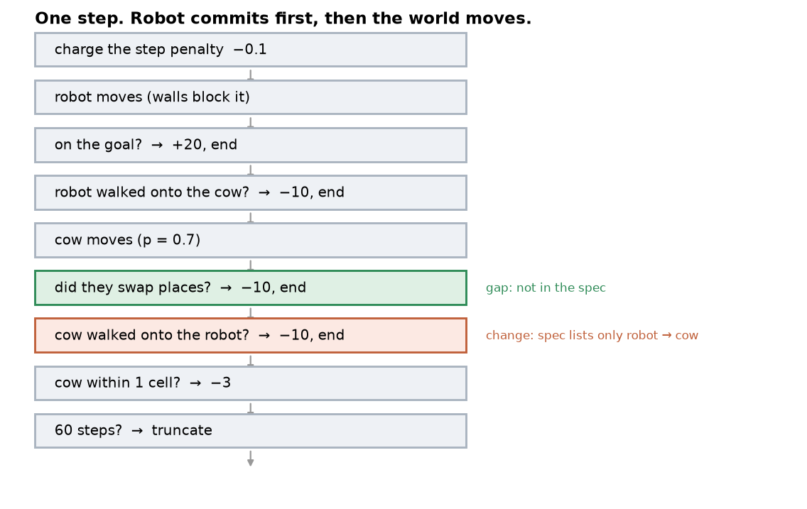
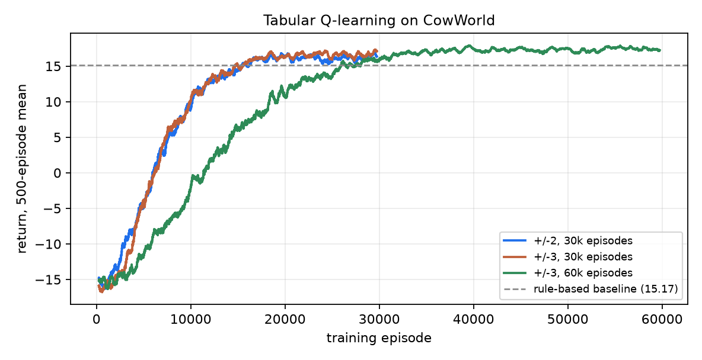
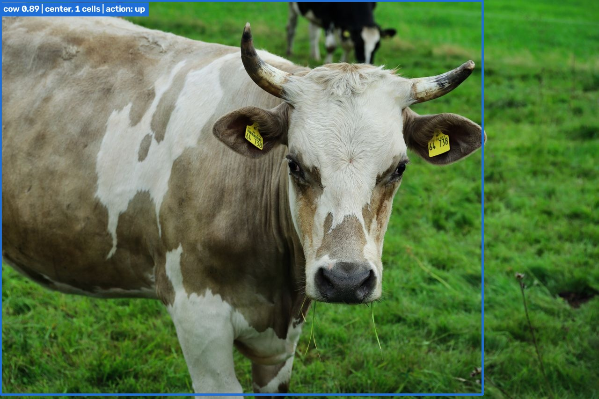

# Problem formulation

The choices I had to make because the task does not specify them, and why I made them. I am
writing this as I go rather than at the end, and I kept the options I rejected, because that
is usually where the reasoning is.

## What the task fixes

These came with the task. I did not choose them, and I have not tuned them, which is what
makes testing the rewards later worth running.


|              |                                                                                               |
| ------------ | --------------------------------------------------------------------------------------------- |
| grid         | 8 × 8, robot starts at (0,0), goal at (7,7)                                                   |
| cow          | starts at the center, and each step moves one cell in a random direction with probability 0.7 |
| episode ends | robot reaches the goal, robot enters the cow's cell, or 60 steps elapse                       |
| too close    | the cow is in one of the 8 cells surrounding the robot                                        |


| event                                  | reward |
| -------------------------------------- | ------ |
| reach the goal                         | +20    |
| collision with the cow                 | −10    |
| too close, charged every step it holds | −3     |
| every step                             | −0.1   |


## 1. State

### What I chose

`(robot_row, robot_col, dr, dc)`, where `dr` and `dc` are the cow's position minus the
robot's, each clipped to the range −2 to +2.

That is 8 × 8 × 5 × 5 = **1,600 states**, or 8,000 Q-values once I add the 5 actions.

### Where the clipping lives, and why I moved it

My first version had the environment do the clipping. `CowWorld(clip=2)` took the radius as a
constructor argument and `reset()` handed back the packed integer directly, so the observation
space was `Discrete(1600)`.

I changed it after reading the Gymnasium custom-environment tutorial the task links to, which
reports structured coordinates and stops there. Sutton & Barto draw the same line from the
theory end: the Markov property is "best viewed as a restriction not on the decision process,
but on the state" (sec 3.1, p.49). The world has exact positions. Deciding that two distant
cows count as the same situation is something I am doing to keep a table small, so it should
sit with the learner.

I had already run into this without noticing. My `_info()` dict was handing true positions
back out, because the rule-based baseline could not work from an observation I had compressed.
Needing a way around my own observation should have told me something.

The environment now reports `MultiDiscrete([8, 8, 8, 8])` — robot row, robot col, cow row, cow
col — and `encoding.py` turns that into a table index at whatever radius the agent asks for.
That gets me ±2 and ±3 running against one environment instance on identical seeds, rather
than two environments I would have to trust were set up the same way, and it puts the baseline
back on the same observation as everything else. It also leaves the door open to DQN or PPO,
which the task allows; `Discrete(1600)` would have meant one-hot vectors of length 1600.

Everything the tutorial lists as required is unchanged: subclassing `gym.Env`, declaring both
spaces, `reset(seed, options)` returning `(obs, info)` with `super().reset(seed=seed)` called
first, and `step` returning the five-tuple.

### The goal is not in the state

I first thought it should be. It should not. The goal is fixed at (7,7), so it holds the same
value in every state and carries no information at all. The robot's own position already
covers it: if the robot is at (2,3), the goal is 9 steps away and down-right. If the goal
moved between episodes this would be a different decision.

### Why the cow is an offset, and why it is clipped

The offset is `cow − robot`, one number per axis. Both coordinates live in 0–7, so the
offset runs from `0 − 7 = −7` up to `7 − 0 = +7`. That is 15 values per axis, not 16: eight
cells means the largest gap between two of them is seven, the same way a ruler marked 0 to 7
has a longest span of 7. Clipping to ±2 leaves 5 of those 15, and everything past the edge
folds onto it.


Using the cow's position relative to the robot was my first instinct, and on its own it is
worse, not better. 15 × 15 = 225 combinations per cow, and I still need the robot's own
position to navigate, so 64 × 225 = 14,400 states — 3.5x worse than just storing both
absolute positions. Clipping is what makes the relative version pay.

How far is far enough? The robot moves one cell and the cow moves one cell, so in one step
they can close two cells of distance:

- At distance 2 the cow can reach the robot's cell next step. That is a collision: −10, and
the episode is over.
- At distance 3 the worst case is ending up adjacent, which costs the −3 too-close penalty
but leaves the robot alive and moving.


So **±2 is the smallest radius where every cow that can hit me next step is still visible**.
I did not pick 2 because it looked reasonable. I picked it because that is where the one-step
reachability line falls, and ±1 would leave the agent blind to a cow that can kill the
episode.


What the clip buys is that states which should behave the same stop being separate. With the
robot at (3,3), a cow at (3,5), (3,6) or (3,7) all become the same row of the table. None of them
can reach the robot next step, so the best action is the same in all three. Without clipping
the agent has to learn that lesson three separate times. For a tabular method this matters:
there is no network to generalize across similar states, so every state is learned on its own
visits.

Sutton & Barto are explicit that convergence needs every state-action pair to keep being
updated -- "all that is required for correct convergence is that all pairs continue to be
updated" (sec 6.5, p.131). Under a fixed episode budget that turns into arithmetic: fewer rows
means more visits per row, and 4,096 rows would spread the same experience over two and a half
times as many of them.

### What it costs

Past the radius the agent cannot tell a cow moving toward it from one moving away. I accepted
that because the cow moves uniformly at random. There is no drift to detect, so the
information is not predictive. However, this stops being true in the harder world where the cow moves toward the robot, and I will have to revisit the radius there.

### Rejected


| alternative                               | states | why not                                                    |
| ----------------------------------------- | ------ | ---------------------------------------------------------- |
| absolute positions `(r_r, r_c, c_r, c_c)` | 4,096  | learns the exact position of a far cow as a separate case  |
| relative offset, not clipped              | 14,400 | loses the robot's own position and is 3.5x larger          |
| goal position included                    | —      | fixed at (7,7), so it is a constant                        |
| clipped at ±1                             | 576    | a cow at distance 2 is invisible and can collide next step |


### Still open: ±3

I assumed a wider radius would be safer. It might not be. With a fixed number of training
episodes, 3,136 states means each state is visited about half as often and the Q-values come
out noisier. More sight is not automatically more safety if the data budget does not grow with
it.

I am building ±2 first because it is the radius I can justify from the dynamics, then
measuring ±3 on the same seeds. Whichever wins, the comparison is the result. I would rather
measure this than argue about it.

### Only 1,156 of the 1,600 rows are reachable

Not every index the encoding can produce corresponds to a situation the grid can actually
produce. The largest index would need the robot at (7,7) and the cow two rows below the
bottom of the board. Checking this exhaustively, 1,156 of the 1,600 rows are addressable and
the mapping onto them is one-to-one. The unreachable rows stay at zero and cost nothing.

### Is the state Markov?

I went and read up on this because I was about to throw information away and wanted to know
whether I was allowed to. The task points at Sutton & Barto chapter 6 for the tabular
Q-learning update; the Markov property itself is defined back in 3.1, and it is the assumption
sitting underneath that update.

Their wording is that the probability of the next state and reward "depends on the immediately
preceding state and action [...] and, given them, not at all on earlier states and actions",
and that the state "must include information about all aspects of the past agent–environment
interaction that make a difference for the future" (p.49).

The reason it matters here is mechanical rather than philosophical: `Q(s, a)` is one number. If
two different pasts land on the same `s` and then behave differently, that single number has to
serve both and settles somewhere in between.

The full `(robot, cow)` state looks fine to me. The cow draws a fresh direction every step and
keeps nothing from the last one, so two cows on the same cell are in the same situation no
matter how they arrived.


The version that would break it is a cow with momentum. If it tended to keep going the way it
was already heading, its position would not be enough — I would need its last direction too,
and that is not in the state. Worth remembering if the harder world later gives the cow a
preferred direction.

### Where clipping breaks it

Clipping blurs the photograph past the edge of the radius. With the robot at (3,3), a cow at
(3,5) and a cow at (3,7) encode to the same state, but their futures are not the same: the
first can be adjacent next step, the second cannot.


So the agent cannot separate two situations whose futures are not the same, which is the thing
the property rules out. Strictly that makes this a POMDP and not a clean MDP, and I only
realized it after I had already settled on the radius.

I am keeping it anyway. The situations being merged mostly want the same action, which was the
reason for merging them in the first place, so the shared Q-value averages over cases that
agree and the averaging costs little.

What I like about this one is that it does not have to stay an argument. If the blur is really
costing the policy, ±3 should come out ahead of ±2, since a wider radius blurs less. That is
now a second reason to run that comparison.

### Measuring "too close"

The task defines too close as the cow being in one of the 8 cells around the robot, so the
distance that matches it is Chebyshev -- max of the two axis gaps, the way a king moves in
chess. Chebyshev distance 1 is those 8 cells and nothing else.

Manhattan distance does not work here. It adds the two gaps instead of taking the larger one,
so the four diagonal neighbors come out at distance 2 and would escape the penalty, while the
four orthogonal ones come out at 1. The cow would be charged for standing beside the robot but
not for standing at its corner, which is not what the task describes and not how a real robot
would think about clearance.

| neighbor | Manhattan | Chebyshev |
|---|---|---|
| (3,4) from (3,3) | 1 | 1 |
| (4,4) from (3,3) | **2** | 1 |

I use Manhattan in one other place, as the rule-based baseline's distance to the goal, and it
is correct there for the opposite reason: the robot moves on 4 directions and never
diagonally, so the number of steps it needs really is the sum of the two gaps.


## 2. Actions

Five actions (up, down, left, right, stay) taken from the task as given. The index into
`MOVES` is the action number.

I kept `stay` rather than dropping it, because it is the only action that lets the robot wait
for the cow to wander off instead of committing to a detour. Whether the learned policy
actually uses it is something I want to read off the results.

## 3. Reward

The four numbers are fixed by the task and listed at the top. There is nothing for me to
decide here, so the open question is not what to set them to but what they will do to the
policy.

### A prediction, written before I run anything

Chapter 6 has a worked example close to this problem. In Cliff Walking (Example 6.6, p.132) a
gridworld has a strip that costs −100 and resets the episode. Q-learning learns the optimal
path, which runs right along the edge of it, while Sarsa learns a longer route further away.
Q-learning then does worse in practice, because ε-greedy exploration keeps pushing it over the
edge even though the values it learned are the optimal ones.

Our version differs in two ways I think matter. The cow wanders, so there is no stable edge to
hug the way there is with a static cliff. And the −3 is charged every step the robot stands
next to the cow rather than once on contact, so three steps spent adjacent costs more than
walking straight into it. That is an odd shape for a reward — it comes from the task, I did
not pick it — but it should make distance worth paying for.

So I expect the learned policy to land closer to the Sarsa side of that example than the
Q-learning side: longer routes, fewer collisions, even though I am running Q-learning. If it
instead learns to skim past the cow, I have read the reward wrong.

I am evaluating greedily with exploration off, so the particular failure in Cliff Walking —
good values, bad behavior because ε keeps acting — should not reach the results table. It
would show up in the training curve.

## 4. Step order

The task gives the environment defaults and adds "you may change them if you explain why"
(p.6). Of the three decisions below, one is a change I am making and two are gaps the spec
never fills. Keeping those apart matters -- a change needs defending, a gap just needs a
choice.



### A cow that walks into the robot also ends the episode (a change)

The spec ends the episode when the robot "enters the cow's cell". Read literally, the cow can
walk onto the robot and nothing happens.

I could not keep that. If only the robot can cause a collision, standing still next to the cow
is free, and the best policy is to park beside it and wait for a clear line to the goal. That
is the opposite of what the title of the task asks for, and it also contradicts the reward:
there is a -3 for being in the 8 cells around the cow, which only makes sense if being there
is dangerous. Charging a penalty for a risk that cannot materialize is incoherent.

So both directions end the episode. This is the one place I am departing from the written
spec.

### Robot moves first, then the cow (a gap)

Nothing in the spec says who goes first, and the choice changes the problem.

I went with the robot. It picks its action from the observation it was handed at the start of
the step, which is how a control loop actually runs -- sensors read, policy decides, actuator
commits, and only then does the world move on. Letting the cow go first would hand the robot
information that arrives after it has already acted.

My first draft of this section claimed that a robot standing next to the cow can be hit no
matter what it does. I checked it rather than leaving it as an assertion, and it is false. The
robot has five destinations counting `stay`, the cow covers five cells after its own move, and
for every one of the robot's options to be covered the two plus-shapes would have to coincide,
which needs the robot and the cow in the same cell -- already a collision. Sweeping all 420
adjacent configurations, **none has zero safe actions**; the worst, in a corner, leaves one.

So collisions next to the cow are avoidable in principle, and the ceiling really is 100%. What
is not free is finding that escape. The safe action is sometimes a single specific move out of
five, it depends on where the cow happens to be, and it is often the move that points away
from the goal. A greedy rule that only avoids cells adjacent to the cow's *current* position
is not computing this, which is one concrete thing a learned policy could beat it on.

This also means I should not explain away a shortfall in success rate as unavoidable risk. If
the agent collides, it had an out and did not take it.

### Swapping places counts as a collision (a gap)

If the robot steps right while the cow steps left into the cell the robot just left, they end
up in each other's old cells. Neither ever occupies the same cell as the other, so a
cell-based check sees nothing, but they have passed through each other.

I count it. The alternative is a renderer that occasionally shows the robot walking through
the cow, and an agent that can learn to exploit it.


## 5. Evaluation

The cow moves on its own, so the same policy produces a different episode every run. Any
comparison is meaningless unless both policies face the same cow, so every number below comes
from the same list of seeds, replayed for each policy in turn.

Training walks seeds up from 0. Evaluation starts at 1,000,000, far past anywhere training can
reach, so a good score cannot just mean the agent had already seen those episodes.

Success rate alone would not tell me much. It cannot separate a policy that keeps its
distance from one that skims past the cow and gets away with it, which is the safety question
this task is asking about. The table also carries collision rate, the share of steps spent
inside the -3 ring, and the closest the robot ever came.

### Results, 500 held-out episodes

| policy | success | collision | timeout | steps to goal | return |
|---|---|---|---|---|---|
| random | 1.8% | 38.6% | 59.6% | 52.1 | -15.04 |
| rule-based | 97.0% | 2.2% | 0.8% | **16.2** | +15.17 |
| Q-learning, radius 2 | **99.0%** | **0.0%** | 1.0% | 17.4 | +16.86 |
| Q-learning, radius 3 | 85.0% | 0.0% | 15.0% | 27.3 | +13.61 |
| Q-learning, radius 3, 60k episodes | 96.8% | 0.0% | 3.2% | 18.2 | **+17.11** |

| policy | steps inside the -3 ring | mean closest approach |
|---|---|---|
| rule-based | 4.74% | 2.33 |
| Q-learning, radius 2 | 2.22% | 2.07 |
| Q-learning, radius 3 | 0.18% | 3.15 |
| Q-learning, radius 3, 60k | 0.58% | 2.38 |

### The baseline is already near optimal

97% success at 16.2 steps, against a shortest path of 14. That leaves roughly three points
for anything else to win, which is less room than I expected when I started.

### Where the learned policy is better

The gain in success rate is two points. The clearer difference is collisions: zero across
500 episodes, against 2.2% for the rule, paid for with about one extra step per episode.

The second table says how. The learned policy spends less than half as long inside the ring,
but its closest approach is nearer than the rule's, so it is not simply keeping a wider berth.
It crosses quickly instead of lingering. The rule holds more average distance and still gets
caught adjacent more often, because it only avoids cells next to where the cow is standing now
and has no way to account for where the cow is about to move. That is the weakness I described
in section 4.

### Checking the prediction from section 3

I wrote down, before running any of this, that the policy should land closer to the Sarsa
side of Cliff Walking than the Q-learning side -- longer routes and fewer collisions, despite
the algorithm being Q-learning. Both parts came out that way: 17.4 steps against the rule's
16.2, and zero collisions against 2.2%.

### Radius 3

I had expected radius 3 to cost something, and it cost more than I thought: 85% success, with
15% of episodes timing out. The policy became so reluctant to go near the cow that it ran out
of steps, spending 0.18% of its time in the ring and keeping a mean closest approach of 3.15.

Doubling the episodes to 60,000 pulled it back to 96.8%, which answers what went wrong. The
deficit was **sample efficiency**, not the representation. 3,136 states spread the same
experience thinner than 1,600 do, and the agent needs roughly twice the data to approach what
the narrower radius reaches. It still does not match it.

One thing about this nearly got past me. The training curves for radius 2 and radius 3 at
30,000 episodes sit almost on top of each other, both plateauing near 16.7, so on training
return alone radius 3 looks fine. Only the held-out evaluation separates them, and the reason
is that training return is measured with exploration still switched on, on episodes the agent
has already seen.




## 6. Driving the policy from a photograph

The task offers a perception bridge as an optional extra: run a detector on a real cow photo,
turn the box into the agent's state, and print the action the policy would choose.
`src/perception_bridge.py` does that with YOLO26n and the Q-table from radius 2.

On a Pexels photo of a cow filling the frame:

```
detection      cow, confidence 0.89
box            (1, 2) to (1031, 844)  -- 99% of frame height
read as        center, 1 cell(s) away
agent state    robot (4, 4), cow (5, 4)  ->  index 917
action         up

  up        0.49
  down     -6.93
  left     -0.57
  right    -0.64
  stay     -0.60
```



The action is to move away from the cow, and the five values show why. Stepping toward it is
worth -6.93, while the three moves that leave the distance at one cell sit together near -0.6
with almost nothing separating them. So the decision being made is not left versus right, it
is toward the cow versus everything else, and the distance between those two numbers is the
-10 the agent learned to avoid. That it survives the trip out of the grid and onto a photo is
what I wanted to check.

### The conversion in the middle is hand-written

There is nothing principled about the conversion. The agent learned over cells; a camera gives
a bearing and an apparent size. Nothing in training says how many cells correspond to a box
filling 99% of the frame, so the thresholds in `perception_bridge.py` are mine. A different
lens, a different cow, or a cow lying down would need different ones, and the policy has no
way to tell me that they were wrong.

I take this to be a small version of a general problem. A policy trained in one
representation cannot take observations from a sensor it never saw unless someone writes the
conversion, and that conversion is not learned, checked, or visible to the policy. It is the
sort of thing I would want to measure rather than assume, the way the radius comparison turned
an argument into a number.


## 7. Two more experiments

### 7.1 Removing the step penalty

The task suggests changing one reward term and showing what it does. I dropped the -0.1 per
step and retrained at radius 2. Everything is still scored against the original rewards, since
the ablation changes what the agent was trained to want, not the yardstick I measure it with.

| policy | success | collision | timeout | steps | steps in ring |
|---|---|---|---|---|---|
| Q, full reward | 99.0% | 0.0% | 1.0% | 17.4 | 2.22% |
| Q, no step penalty | 96.6% | 0.0% | 3.4% | 19.8 | 1.51% |

Without the step penalty there is no cost to taking the long way, so the agent buys more
caution than the task wants: it spends even less time beside the cow, and pays for it with
2.4 extra steps and three times the timeouts. The -0.1 is not a detail. It is the term that
makes safety and speed trade against each other at all, and with it gone the agent optimizes
one of them alone.

### 7.2 A cow that chases

The harder world the task suggests. The cow now heads for the robot on 70% of the steps it
moves, closing the larger of the two gaps, instead of picking a direction at random.

| policy | success | collision | timeout | steps | steps in ring |
|---|---|---|---|---|---|
| rule-based | 78.4% | 21.6% | 0.0% | 15.7 | 24.04% |
| Q, trained here, radius 2 | 92.0% | 7.6% | 0.4% | 25.6 | 12.36% |
| **Q, trained here, radius 3** | **95.0%** | **5.0%** | 0.0% | 19.2 | 8.98% |
| Q, trained in the easy world | 83.2% | 15.8% | 1.0% | 22.2 | 30.16% |

This is where the question I left open in section 1 finally gets an answer.

**The rule falls apart.** 97% to 78.4%, with collisions going from 2.2% to 21.6%. Avoiding the
cell the cow is standing in works against a cow that wanders. It does not work against one
that is coming for you.

**Which finally gives the learned policy room.** In the original world it beat the rule by two
points. Here the gap is 16.6.

**And radius 3 now wins.** This is the reversal I said I would watch for. My reason for
clipping the state was that a uniformly random cow has no drift to detect, so the position of
a distant cow carries nothing a policy could use. That reason does not survive a cow with a
direction, and the numbers follow: radius 3 reaches 95.0% against radius 2's 92.0%, with fewer
collisions and six fewer steps. The information I was throwing away as worthless became worth
something the moment the cow acquired an intention.

The last row is the policy from the easy world dropped in here untouched. It manages 83.2%,
and spends 30% of its steps inside the ring, which is worse than the hand-written rule. It was
trained against a cow that does not chase and it has no way to notice that the cow now does.

## References

Sutton, R. S. and Barto, A. G., *Reinforcement Learning: An Introduction*, 2nd edition, 2020.
The task lists chapter 6 as background reading.

- sec 3.1, p.49 — the Markov property, and the point that it restricts the state rather than
  the process
- sec 6.5, p.131 — the Q-learning update (6.8), and the convergence requirement that all
  state-action pairs keep being updated
- Example 6.6, p.132 — Cliff Walking, where Q-learning takes the optimal risky path and Sarsa
  takes the safer one

Gymnasium, *Create a Custom Environment* — the required structure for `gym.Env`, which this
environment follows apart from reporting coordinates instead of a packed index.
